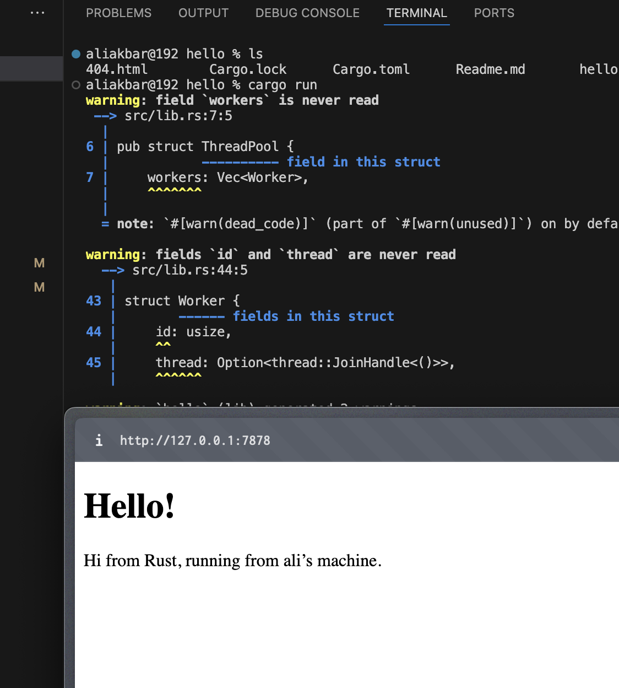

**Commit 1 Reflection**
Pada implementasi ini, saya mempelajari dasar pembuatan server sederhana menggunakan Rust dengan TcpListener dan TcpStream. Program melakukan binding ke alamat lokal dan mendengarkan koneksi yang masuk, lalu setiap koneksi diproses melalui fungsi terpisah. Hal ini membantu saya memahami alur dasar bagaimana server menerima dan menangani request dari client.
Dalam prosesnya, saya juga belajar membaca HTTP request menggunakan BufReader dan iterator seperti .lines(), .map(), dan .take_while(). Dengan pendekatan ini, saya dapat mengambil bagian header dari request hingga mencapai baris kosong sebagai penanda akhir header. Ini memberi saya pemahaman lebih jelas tentang struktur dasar HTTP request dan bagaimana cara memprosesnya secara manual.
Selain itu, saya menyadari bahwa penggunaan .unwrap() untuk error handling masih bersifat sederhana dan berisiko menyebabkan panic. Dari sini, saya mendapatkan insight bahwa pengembangan selanjutnya perlu mencakup error handling yang lebih baik, serta penambahan fitur seperti HTTP response dan concurrency agar server menjadi lebih optimal dan mendekati implementasi di dunia nyata.

**Commit 2 Reflection**

Pada tahap ini, saya berhasil mengembangkan server sederhana di Rust sehingga tidak hanya menerima request, tetapi juga dapat mengirimkan response berupa halaman HTML. Dengan menggunakan TcpListener dan TcpStream, server mampu menangani koneksi masuk dan memproses HTTP request secara manual, yang memberi saya pemahaman lebih dalam tentang bagaimana komunikasi client-server bekerja di level rendah.

Saya juga belajar bagaimana membaca file HTML menggunakan fs::read_to_string dan menyusunnya menjadi HTTP response lengkap dengan status line dan header seperti Content-Length. Proses formatting response ini membantu saya memahami struktur dasar HTTP response, serta bagaimana browser dapat menampilkan konten berdasarkan data yang dikirim oleh server.

Selain itu, saya mulai menyadari pentingnya penanganan error yang lebih baik karena penggunaan .unwrap() masih berisiko menyebabkan program crash. Ke depannya, saya ingin menambahkan fitur seperti routing sederhana (misalnya membedakan path request), concurrency untuk menangani banyak client sekaligus, serta error handling yang lebih aman agar server menjadi lebih robust dan mendekati implementasi nyata.

**Commit 3 Reflection**
Pada tahap ini, saya berhasil meningkatkan fungsionalitas server dengan menambahkan routing sederhana berdasarkan request line. Dengan membaca baris pertama dari HTTP request, server dapat membedakan antara permintaan ke root path (/) dan permintaan lainnya. Hal ini memberikan pemahaman yang lebih jelas tentang bagaimana server menentukan response berdasarkan endpoint yang diminta oleh client.

Saya juga mengimplementasikan pengiriman response yang berbeda, yaitu halaman hello.html untuk request yang valid dan 404.html untuk request yang tidak dikenali. Dengan ini, saya belajar bagaimana status code seperti 200 OK dan 404 NOT FOUND digunakan dalam HTTP, serta bagaimana server dapat memberikan feedback yang sesuai kepada client melalui konten yang berbeda.

Selain itu, proses ini membuat saya semakin memahami pentingnya struktur HTTP request dan response, sekaligus menyadari bahwa implementasi saat ini masih sederhana. Ke depannya, saya ingin mengembangkan sistem routing yang lebih fleksibel, meningkatkan error handling tanpa .unwrap(), serta menambahkan concurrency agar server dapat menangani banyak request secara efisien.

**Commit 4 Reflection**
Pada tahap ini, saya mengembangkan sistem routing menggunakan match sehingga kode menjadi lebih rapi dan mudah diperluas dibandingkan pendekatan sebelumnya. Dengan mencocokkan request_line, server dapat menangani beberapa endpoint seperti / dan /sleep, serta memberikan response yang berbeda sesuai permintaan client. Hal ini membantu saya memahami bagaimana mekanisme routing dasar bekerja dalam server dan bagaimana struktur kode dapat dibuat lebih scalable.

Saya juga menambahkan simulasi delay menggunakan thread::sleep pada endpoint /sleep, yang memberikan gambaran nyata tentang dampak operasi blocking pada server. Dari sini, saya menyadari bahwa pendekatan single-threaded memiliki keterbatasan dalam menangani banyak request secara bersamaan. Oleh karena itu, ke depannya saya ingin mengimplementasikan concurrency seperti multi-threading atau thread pool agar performa server menjadi lebih efisien dan responsif.

**Commit 5 Reflection**
Pada tahap ini, saya berhasil mengembangkan web server menjadi concurrent dengan mengimplementasikan thread pool. Dengan menggunakan mpsc channel serta Arc<Mutex<...>>, setiap request yang masuk dapat dikirim sebagai job ke worker thread yang tersedia. Hal ini membuat server tidak lagi memproses request secara berurutan, tetapi mampu menangani banyak koneksi secara paralel, sehingga performanya menjadi lebih efisien.

Saya juga mendapatkan pemahaman yang lebih dalam tentang konsep ownership dan concurrency di Rust. Penggunaan closure dengan keyword move menjadi penting agar data seperti TcpStream dapat dipindahkan ke thread lain dengan aman tanpa melanggar aturan ownership. Selain itu, saya mulai memahami bagaimana sinkronisasi data antar thread bekerja melalui Mutex, serta bagaimana komunikasi antar thread dapat dilakukan dengan channel.

Selain meningkatkan performa, implementasi ini juga membuka wawasan saya tentang bagaimana sistem yang lebih kompleks dapat dibangun di atas konsep dasar ini. Saya menyadari bahwa masih ada beberapa hal yang perlu dikembangkan, seperti error handling yang lebih aman, mekanisme graceful shutdown untuk thread pool, serta optimasi lebih lanjut agar server menjadi lebih stabil dan siap digunakan dalam skala yang lebih besar.
